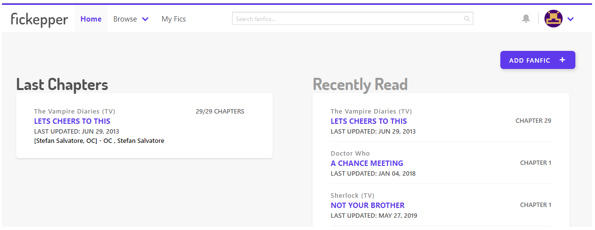
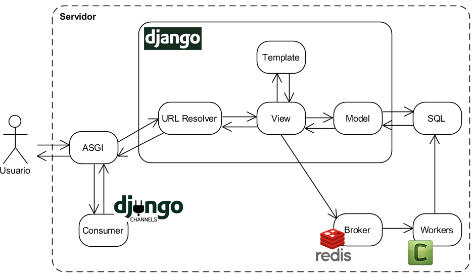
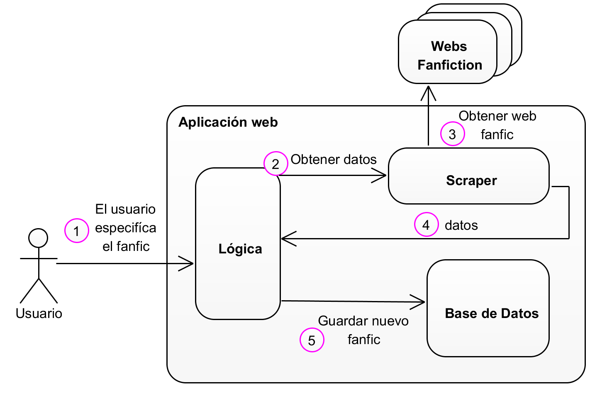
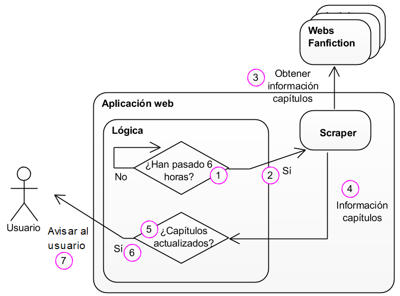

<h3 align="center">Manage and stay up-to-date with your fanfics</h3>

    
    
    

------

## 🧐 Descripción

Como Trabajo de Fin de Grado (**TFG**) se ha desarrollado una aplicación web que permite gestionar fanfics o historias ficticias. Los usuarios podrán llevar la cuenta de los capítulos que han leído y que les quedan por leer de forma sencilla. También se les avisará cuando alguno de sus fanfics se actualice. Se ha utilizado el *framework* de Python Django.

Se podrán añadir nuevos fanfics **importando** estos desde las siguientes páginas web:

- [FicWad.com](https://ficwad.com/)
- [AvengersFanfiction.com](http://www.avengersfanfiction.com/)
- [ArchiveOfOurOwn.org](https://archiveofourown.org/)

También se pueden crear **listas** para organizar los fanfics. Además, la aplicación web cuenta con un sistema de **notificaciones** en tiempo real, para que los usuarios puedan estar al tanto de las últimas **actualizaciones** de los fanfics y de otros miembros de la aplicación. Por último, se ha implementado un sistema de **recomendaciones** para poder ofrecer fanfics similares a uno visitado, además de ayudar a visualizar los datos obtenidos de los usuarios para ayudar a tomar decisiones de negocio.

[Documentación pdf](https://github.com/pauladj/django-manage-fanfics/blob/master/Documentaci%C3%B3n.pdf)

## 🔧 Setup 

Las instrucciones de instalación se encuentran en el Anexo V de la [documentación](https://github.com/pauladj/django-manage-fanfics/blob/master/Documentaci%C3%B3n.pdf). Los ficheros ahí mencionados están dentro del fichero comprimido "Ficheros instalación.zip".

## 📽️ Video demo

## ⛏️ Herramientas y conceptos utilizados

- **Django** y **Python** para realizar la aplicación.
- **Celery**, **Django Channels** (protocolo **WebSocket**) y **Redis** para las tareas asíncronas (importar fanfic, comprobar si el fanfic se ha actualizado y generar recomendaciones) y notificaciones de los usuarios.

- Algunas librerías de Django: **Django Extensions**, **Django Countries** y **Widget Tweaks**.
- **Panel de administración** de Django.
- Windows Subsystem for Linux (**WSL**) para instalar Redis.
- Framework de CSS basado en *Flexbox*, **Bulma.io**
- Pell (https://github.com/jaredreich/pell), simple **editor WYSIWYG** para la creación y edición de reseñas de un fanfic.
- ***Tooltips* y *popovers*** usando la librería Tippy (https://atomiks.github.io/tippyjs/).
- **Adobe XD** para la generación de los prototipos de alta fidelidad. Prototipos diseñados para escanear, no para leer (**UX**).

El listado completo de herramientas se encuentra en la [documentación](https://github.com/pauladj/django-manage-fanfics/blob/master/Documentaci%C3%B3n.pdf).

El diagrama correspondiente a **añadir un fanfic** es el siguiente:

Cada x tiempo se **comprueba** si se han **añadido** **capítulos** a alguno de nuestros fanfics:

## 👓 Capturas de pantalla 

Para ver más capturas de pantalla visitar la [documentación](https://github.com/pauladj/django-manage-fanfics/blob/master/Documentaci%C3%B3n.pdf).

    &nbsp;&nbsp;
    &nbsp;&nbsp;
    &nbsp;&nbsp;
    &nbsp;&nbsp;
    &nbsp;&nbsp;

